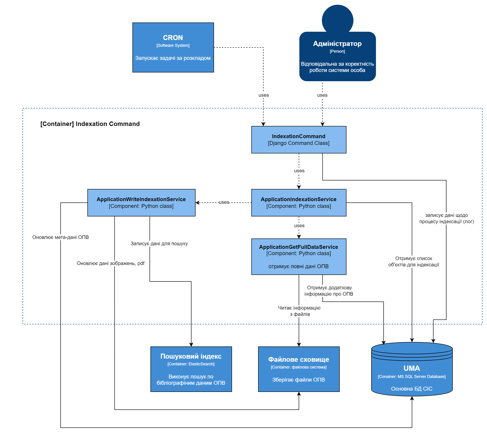

########################################################
Підсистема завантаження інформації до пошукового індексу
########################################################

*********************
1. Загальні відомості
*********************

1.1. Назва програми
###################

Програма «Підсистема завантаження інформації до пошукового індексу» (далі - Підсистема).

1.2. Програмне забезпечення, необхідне для функціонування програми
##################################################################

.. list-table::
   :width: 100 %
   :widths: 25 75

   * - CentOS 7 x64
     - Операційна система, встановлена на сервері
   * - CPython 3.10+
     - Інтерпретатор мови програмування Python
   * - | ElasticSearch 6.6
       | (зі встановленим плагіном
       | Ukrainian analysis plugin)
     - Програмне забезпечення для повнотекстового пошуку інформації
   * - Microsoft SQL Server 2016
     - Система управління базами даних

1.2. Мови програмування, на яких написана програма
##################################################

Підсистема написана на мові програмування Python.

****************************
2. Функціональне призначення
****************************

2.1. Призначення програми
#########################

Підсистема призначена для завантаження даних про об’єкти промислової власності (далі - ОПВ) до пошукового індексу
програмного забезпечення ElasticSearch. Підсистема вирішує наступні задачі:

* З бази даних "UMA" (сервер БД Rhino (10.10.18.1)) отримує список об'єктів, що необхідно додати до пошукового індексу;
* Отримує детальну інформацію об'єктів з файлового сховища;
* Готує структури даних та записує їх у пошуковий індекс ElasticSearch;
* Вносить зміни у файлове сховище (наприклад, при цензуруванні зображення або необхідності видалення файлів якщо публікація є обмеженою);
* Виводить лог помилок при їх наявності.

**************************
3. Опис логічної структури
**************************

3.1. Структура програми
#######################

Підсистема створена як `Management command <https://docs.djangoproject.com/en/dev/howto/custom-management-commands/>`_ для
фреймворку Django. Тобто як команда, що виконується з командної строки за допомогою скрипта Django manage.py.

Нижче наведено опис програми з використанням діаграм `моделі C4 <https://c4model.com/>`_.

3.1.1. Діаграма рівня контейнерів (C2) для Підсистеми
-----------------------------------------------------

.. list-table:: Опис складових частин діаграми:
   :width: 100 %
   :widths: 25 75

   * - CRON
     - | Утиліта на сервері **10.11.11.51 (Panda)**, яка дозволяє виконувати
       | команди або скрипти (групи команд) автоматично в заданий час.
   * - Адміністратор
     - | Особа, що запускає Підсистему з командного рядка
       | на сервері **10.11.11.51 (Panda)**
   * - Indexation Command
     - | Класс Python, який є головним у підсистемі, оскільки слугує
       | для запуску програми. Являє собою реалізацію
       | **Django Management command**.
   * - UMA
     - | Основна база даних СІС на сервері **10.10.18.1 (Rhino)**. Побудована на
       | базі СУБД Microsoft SQL Server 2016.
   * - Файлове сховище
     - | Мережевий каталог на сервері **10.10.18.4 (Bear)**.
       | Містить дані щодо ОПВ (.json-файли з бібліографічною інформацією,
       | зображення, pdf).

3.1.2. Діаграма рівня компонентів (C3) для Підсистеми
------------------------------------------------------

.. list-table:: Опис складових частин діаграми:
   :width: 100 %
   :widths: 25 75

   * - CRON
     - | Утиліта на сервері **10.11.11.51 (Panda)**, яка дозволяє
       | виконувати команди або скрипти (групи команд)
       | автоматично в заданий час.
   * - Адміністратор
     - | Особа, що запускає Підсистему з командного рядка
       | на сервері **10.11.11.51 (Panda)**
   * - IndexationCommand
     - | Класс Python, який є головним у підсистемі, оскільки слугує
       | для запуску програми. Являє собою реалізацію
       | **Django Management command**.
   * - ApplicationIndexationService
     - Сервіс (класс Python), виконує функцію індексації ОПВ.
   * - ApplicationGetFullDataService
     - | Сервіс (класс Python), виконує функцію отримання та
       | підготовки бібліографічної інформації щодо ОПВ для
       | індексації.
   * - ApplicationWriteIndexationService
     - | Сервіс (класс Python), виконує функцію запису
       | бібліографічної інформації у пошуковий індекс,
       | оновлення інформації у файловій системі, БД.
   * - UMA
     - | Основна база даних СІС на сервері **10.10.18.1 (Rhino)**.
       | Побудована на базі СУБД Microsoft SQL Server 2016.
   * - Файлове сховище
     - | Мережевий каталог на сервері **10.10.18.4 (Bear)**.
       | Містить дані щодо ОПВ (.json-файли з бібліографічною
       | інформацією, зображення, pdf).

3.1.3. Діаграма рівня програмного коду (C4) для Підсистеми
-----------------------------------------------------------

Нижче представлено опис класів, що були розроблені для функціонування Підсистеми.

.. autoclass:: apps.search.management.commands.search_indexation.Command
   :members:

.. autoclass:: apps.search.models.IndexationProcess
   :members:
   :exclude-members: DoesNotExist, MultipleObjectsReturned

.. autoclass:: apps.search.services.application_indexators.ApplicationIndexationService
   :members:
